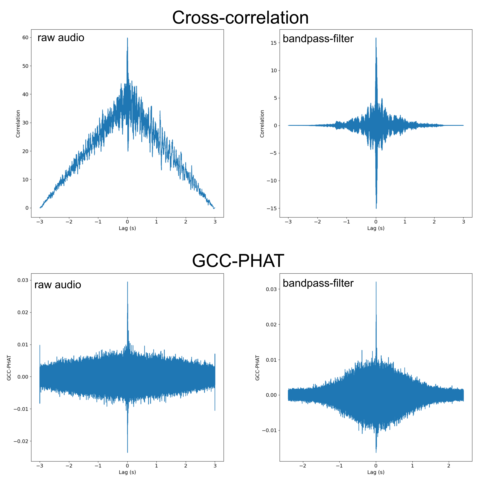
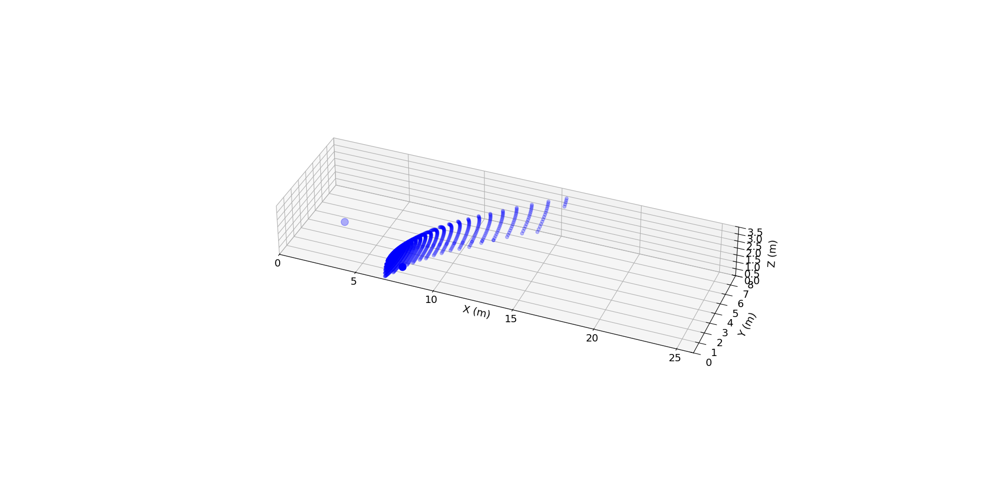
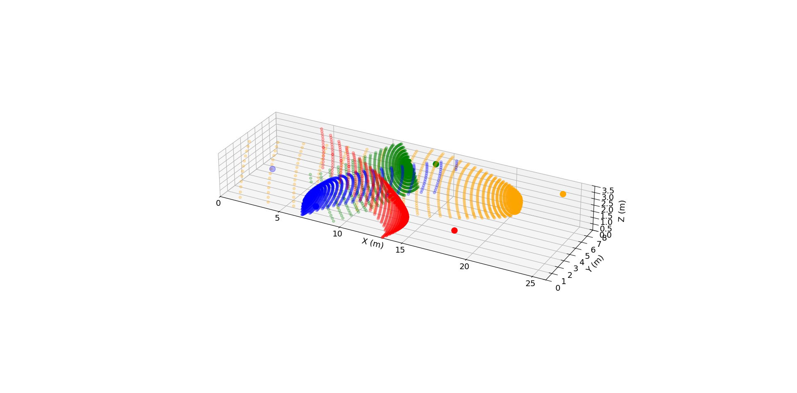
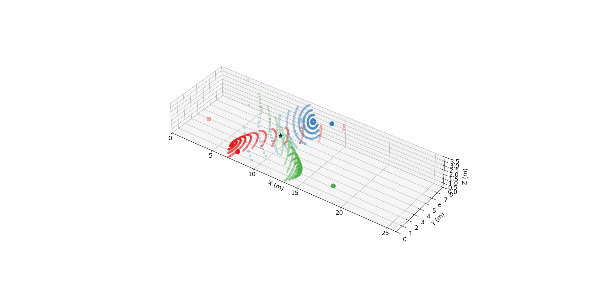
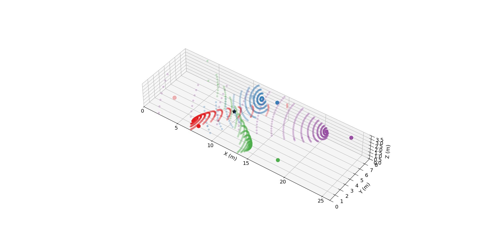

# COPIRAIT: COrvids and Primates Identification and Recognition using Artificial InTelligence

COPIRAIT is a research project aiming to develop a system to continuously monitor the behaviour and in particular the communication of animal species in captivity. COPIRAIT focuses on two model species: a group of rooks (*Corvus frugileus*) hosted in an aviary on the CNRS campus in Cronenbourg, France, and a group of Barbary macaques (*Macaca  sylvanus*) hosted in Zoopark Beauval, France.

## Installation instructions

TO DO

## Tutorial

### Sound source localisation (package triangulation)

```(python)
# Example script for the localisation of a sound source within a known area

###############################################################################
# Initialisation
###############################################################################

import numpy as np
import soundfile as sf
import matplotlib.pyplot as plt
import src.triangulation as tri

plt.rcParams['font.size'] = 14

# Set microphone positions
mic_positions = np.array([[4, 0.9, 2.8], [8, 0.15, 1.1],
                          [10, 7.85, 1.1], [14, 7.1, 2.8],
                          [15, 0.15, 1.9], [19, 0.15, 1.95],
                          [20, 7.85, 1.1], [24, 7.1, 2.8]
                          ]
                         )

# Set boundaries of the volume of interest
aviary_size = np.array([[0, 26], [0, 8], [0, 3.5]])

# Load audio files for testing
signals, sr = sf.read("C:/Users/benti/Desktop/audio_example.wav")
# 8 channel audio with recordings of the same sound from 8 recorders
# Channels (0, 1), (2, 3), (4, 5), and (6, 7) are synchronised

###############################################################################
# Measure distance differences between pairs of synchronised microphones
###############################################################################

# Crosscorrelation, raw audio
tdoa_cc_raw = tri.cross_correlation(signals[:, 0], signals[:, 1], sr,
                                    plot=True, filter=False
                                    )

# Crosscorrelation, bandpass-filtered
tdoa_cc_filt = tri.cross_correlation(signals[:, 0], signals[:, 1], sr,
                                     plot=True, filter=True
                                     )

# GCC-PHAT, raw audio
tdoa_gcc_nofilt = tri.gcc_phat(signals[:, 0], signals[:, 1], sr,
                               plot=True, filter=False
                               )

# GCC-PHAT, bandpass-filtered
tdoa_gcc_filt = tri.gcc_phat(signals[:, 0], signals[:, 1], sr,
                             plot=True, filter=True
                             )


d1 = tri.tdoa_to_distancediff(tri.gcc_phat(signals[:, 0], signals[:, 1], sr))
d2 = tri.tdoa_to_distancediff(tri.gcc_phat(signals[:, 2], signals[:, 3], sr))
d3 = tri.tdoa_to_distancediff(tri.gcc_phat(signals[:, 4], signals[:, 5], sr))
d4 = tri.tdoa_to_distancediff(tri.gcc_phat(signals[:, 6], signals[:, 7], sr))
```



```python
###############################################################################
# Visualise revolution hyperboloid
###############################################################################

# Visualise a single revolution hyperboloid
fig, ax = tri.plot_hyperboloid(mic_positions[[0, 1]], d1, n_step=100)
ax.set_aspect('equal')
plt.show()
```



```python
# Visualise all revolution hyperboloids
fig = plt.figure(figsize=(12, 8))
ax = fig.add_subplot(projection='3d')

fig, ax = tri.plot_hyperboloid(mic_positions[[0, 1]], d1, n_step=100,
                               col='blue', fig=fig, ax=ax
                               )
fig, ax = tri.plot_hyperboloid(mic_positions[[2, 3]], d2, n_step=100,
                               col='green', fig=fig, ax=ax
                               )
fig, ax = tri.plot_hyperboloid(mic_positions[[4, 5]], d3, n_step=100,
                               col='red', fig=fig, ax=ax
                               )
fig, ax = tri.plot_hyperboloid(mic_positions[[6, 7]], d4, n_step=100,
                               col='orange', fig=fig, ax=ax
                               )

ax.set_aspect('equal')
plt.show()
```




```python
###############################################################################
# Resolve position for a triplet of pairs using Gauss-Newton approach
###############################################################################

pos, info = tri.localise_3pairs(mic_positions[0:6], [d1, d2, d3],
                                bounds=aviary_size, initial_guess=None
                                )

fig, ax = tri.plot_hyperboloids_solutions([pos], mic_positions[0:6],
                                          [d1, d2, d3], n_step=50,
                                          bounds=aviary_size
                                          )
ax.set_aspect('equal')
plt.show()
```




```
###############################################################################
# Resolve position for all microphones using Gauss-Newton approach
###############################################################################

pos, info = tri.localise_allpairs(mic_positions, signals, sr,
                                  bounds=aviary_size, initial_guess=None
                                  )

fig, ax = tri.plot_hyperboloids_solutions(pos, mic_positions,
                                          [d1, d2, d3, d4], n_step=50,
                                          bounds=aviary_size,
                                          )
ax.set_aspect('equal')
plt.show()
```



TO DO

## References

Not yet published

## Licence

TO DO